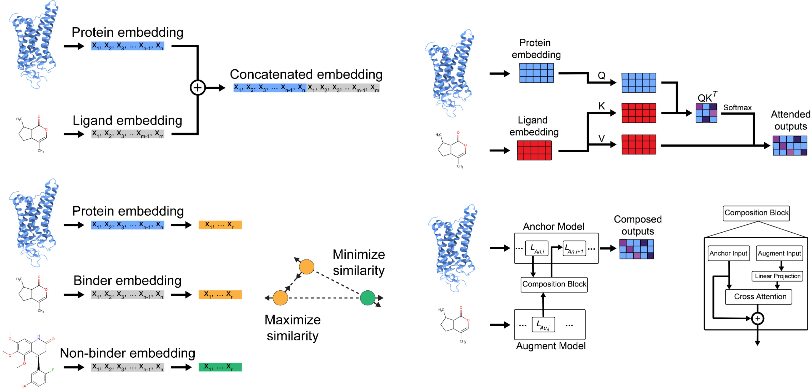

## Integrating Large Language Models to Learn Biophysical Interactions [[Preprint](https://arxiv.org/abs/2503.21017)]

 

<div align="justify">
Large language models (LLMs) trained on biochemical sequences learn feature vectors that guide drug discovery through virtual screening. However, LLMs do not capture the molecular interactions important for binding affinity and specificity prediction. We compare a variety of methods to combine representations from distinct biological modalities to effectively represent molecular complexes. We demonstrate that learning to merge the representations from the internal layers of domain specific biological language models outperforms standard molecular interactions representations despite having significantly fewer features. 
</div>

## Citation:
```
@misc{BioLLMComposition.
      title={Two for the Price of One: Integrating Large Language Models to Learn Biophysical Interactions}, 
      author={Joseph D. Clark and Tanner J. Dean and Diwakar Shukla},
      year={2025},
      eprint={2503.21017},
      archivePrefix={arXiv},
      primaryClass={q-bio.BM},
      url={https://arxiv.org/abs/2503.21017}, 
}
```
